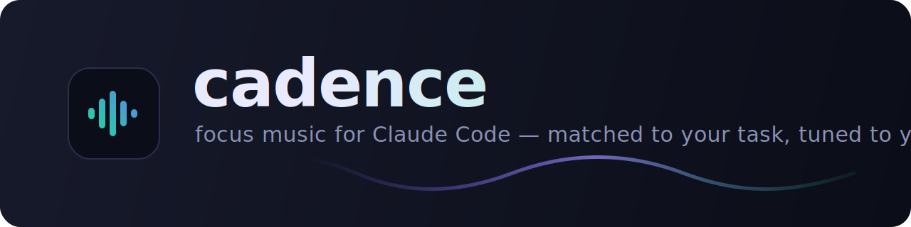

<p align="center">
  
</p>

<p align="center">
  <b>Cadence</b> detects what you're working on and plays Spotify music matched to the task — tuned to your taste, learned over time, to keep you in flow.
  <br><br>
  <a href="#install"></a>
  
  
  = 18">
</p>

---

## What it does

You code. Cadence quietly reads the *shape* of your work — debugging, writing docs,
planning, reviewing, crunching — and plays music chosen to suit it: lyric-free
deep-focus beats while you implement, warm steady jazztronica while you debug,
peaceful piano while you write, driving DnB when you're shipping under pressure.

- 🎚️ **Auto-switches** music as your task changes — or stays fully manual. Your call.
- 🧠 **Learns your taste** per work mode from your feedback (love / like / dislike / ban / more-like-this) and your listening — all **100% local**.
- 🎯 **9 curated vibes** mapped to work modes, each grounded in focus/attention research.
- 🔌 **Spotify Web API** (OAuth PKCE) with a **playerctl/AppleScript fallback** so basic control works even without Premium on Linux/macOS.
- 🔒 **Private by design** — tokens in your OS keychain, preferences in a local file, nothing phoned home.

## How it works

```
 Claude Code session
        │
   hooks (UserPromptSubmit / SessionStart)   ← ~5ms, non-blocking
        │  one-line event over a Unix socket
        ▼
   Cadence MCP server  ── the single "brain" ──────────────┐
        │                                                   │
   ┌────┴─────┬───────────────┬──────────────┬─────────────┤
 detect     curation       learning        Spotify       local
 work mode  9-vibe map   (local, no-ML)    Web API     playerctl
                                                        / AppleScript
        ▲
   slash commands (/cadence:play, /cadence:vibe, …) → mcp__cadence__* tools
```

One MCP server owns everything (OAuth, state, curation, learning, playback).
Hooks are deliberately dumb — they fire a tiny event at the brain and exit
immediately, so they never stall your turn. Discovery is built entirely on
Spotify's **surviving** API surface (search + your own library) and a local,
fully-deterministic preference model — no ML training on Spotify content.

## Install

> **Requires:** Node.js ≥ 18, a free Spotify account (Premium for Web API playback
> control — see [limitations](#spotify-2026-limitations-read-this)), and your own
> Spotify app Client ID (one-time, 2 minutes — below).

### 1. Create your Spotify app (one time)

1. Go to the [Spotify Developer Dashboard](https://developer.spotify.com/dashboard) → **Create app**.
2. Add this exact **Redirect URI**: `http://127.0.0.1:8888/callback`
   - use the `127.0.0.1` loopback IPv4 literal — **`localhost` is rejected by Spotify**
   - `http` (not `https`) is allowed because it's loopback
   - if port `8888` is taken on your machine, set a different `auth_port` in the
     plugin config and register the matching `http://127.0.0.1:<port>/callback`
3. Copy the **Client ID**.

### 2. Add the plugin

```
/plugin marketplace add lomartins/cadence
/plugin install cadence@cadence-marketplace
```

When prompted, paste your **Client ID** and pick your **market** (e.g. `US`, `GB`, `BR`).

### 3. Connect & play

```
/cadence:connect      # opens your browser, waits for the callback, shows status
/cadence:play         # start focus music for what you're doing
```

`connect` blocks until you click **Agree** in the browser, then reports the live
connection status.

**Auto-switch** is on by default but deliberately gentle: it only re-vibes music
that's **already playing**, and only in response to **your prompts** (never tool
activity), with a 4-minute debounce. It never starts music on its own. Turn it
off any time with `/cadence:auto off` — then music only changes when you ask.

## Commands

Plugin commands are namespaced under `cadence:` (type `/cadence:` to see them all):

| Command | What it does |
|---------|--------------|
| `/cadence:connect [url]` | Authorize Spotify (waits for callback). Optional pasted URL for headless/SSH |
| `/cadence:disconnect` | Clear stored tokens |
| `/cadence:play [vibe] [0-4]` | Start music for the current task |
| `/cadence:pause` · `/cadence:resume` · `/cadence:skip` | Transport controls |
| `/cadence:vibe <slug>` | Switch vibe |
| `/cadence:intensity <0-4>` | Energy: 0 minimal … 4 peak |
| `/cadence:auto [on\|off\|toggle]` | Automatic switching |
| `/cadence:love` · `/cadence:dislike` · `/cadence:ban` | Teach your taste |
| `/cadence:status` | What's happening |
| `/cadence:reset [all\|vibe]` | Reset learned preferences |
| `/cadence:focus [vibe] [0-4]` | Shortcut to start instantly |

You can also just *talk* to Claude: "play something calmer", "I love this one",
"stop changing the music" — the bundled skill maps that to the right MCP tool.

## The vibes

| Vibe | For | Character |
|------|-----|-----------|
| `deep-focus` | implementation / deep-focus coding | lo-fi, ambient, chillhop — lyric-free, steady |
| `steady-flow` | debugging | warm chillhop / nu-jazz — predictable, frustration-buffering |
| `wordless-write` | writing & docs | solo piano / neoclassical — zero lyrics, protects verbal WM |
| `open-think` | planning / architecture | ambient / generative — spacious, aids divergent thinking |
| `calm-read` | code review / reading | quiet ambient / drone — low-arousal, preserves comprehension |
| `alert-study` | learning / research | chillhop / baroque — alert but unobtrusive |
| `momentum` | repetitive / mechanical | house / nu-disco / funk — upbeat, lyrics OK |
| `decompress` | breaks | indie folk / bossa nova — high-valence, restorative |
| `drive` | crunch / shipping | DnB / techno / epic score — high-energy, propulsive |

Each vibe carries an intensity scale (0–4) that widens/narrows the BPM and energy
band of the search. Rationale for every choice lives in
[`src/data/presets.json`](src/data/presets.json).

## How learning works

Every signal — explicit (love/like/dislike/ban/more) and implicit (completed,
skipped-early, replayed, accepted/rejected auto-switch) — is appended to a local
`feedback.jsonl` and folded into per-vibe preference profiles: artist/genre/track
scores (weighted updates + exponential decay), an audio-intent centroid, and a
time-of-day histogram. Candidate tracks are ranked with an explainable weighted
sum, and selection is **epsilon-greedy** (explore vs exploit) with a per-artist
diversity cap so it never goes stale.

It is **deterministic statistics, not ML** (counts, decay, Welford mean/var) —
both to stay explainable and to respect Spotify's terms. `state.json` is just a
fold over the log — it can be recomputed from scratch (the `rebuild` tool).

Everything customizable lives in `config.json` (ranking weights, signal deltas,
thresholds, decay half-life, explore epsilon, auto-switch debounce/confidence).

## Privacy

- **Local only.** No telemetry. The only network calls are to *your own*
  authenticated Spotify API.
- **Tokens** live in your OS keychain (libsecret / Keychain / Credential Manager),
  falling back to a `0600` file. Never in `state.json`, never in the repo.
- **Track titles are not stored** by default (`privacy.store_track_titles: false`) —
  only opaque Spotify URIs.
- `/cadence:reset` (plus `export` / `forget <uri>` / `rebuild` — just ask Claude) give you full control.

## Spotify 2026 limitations (read this)

Spotify heavily restricted the Web API for new apps (Nov 2024 + Feb/Mar 2026).
Cadence is built around what *survives*, but you should know:

- **You supply your own Client ID.** A dev-mode app is capped at **5 users**, so
  sharing one app doesn't scale — each user registers their own (2 min, above).
- **The app owner (you) must have an active Spotify Premium** subscription for the
  app to function at all, and **playback control** (play/pause/skip) requires the
  listening account to be Premium.
- **No Premium?** On **Linux** (`playerctl`) and **macOS** (AppleScript) Cadence
  falls back to controlling your desktop Spotify app for play/pause/next (no track
  selection). Windows without Premium can't control playback.
- **Recommendations / audio-features / related-artists endpoints are gone** for new
  apps — Cadence discovers via Search + your library instead, which is why curated
  search queries and your own taste do the heavy lifting.
- **Refresh tokens expire after ~6 months** — you'll re-run `/cadence:connect`
  about twice a year.

## Develop

```bash
npm install        # also builds dist/ via the prepare hook
npm run build      # esbuild bundle -> dist/
npm run typecheck  # tsc --noEmit
npm test           # vitest
npm run dev        # run the MCP server directly (uses .env)
```

Architecture details: [`docs/ARCHITECTURE.md`](docs/ARCHITECTURE.md).

## License

MIT © Luisa Martins. See [LICENSE](LICENSE).

<p align="center"><sub>Built to keep you in flow. 🎧</sub></p>
